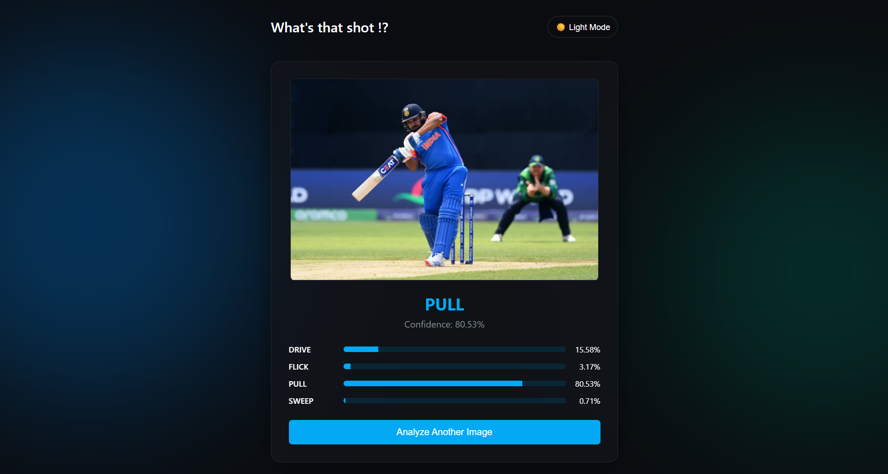
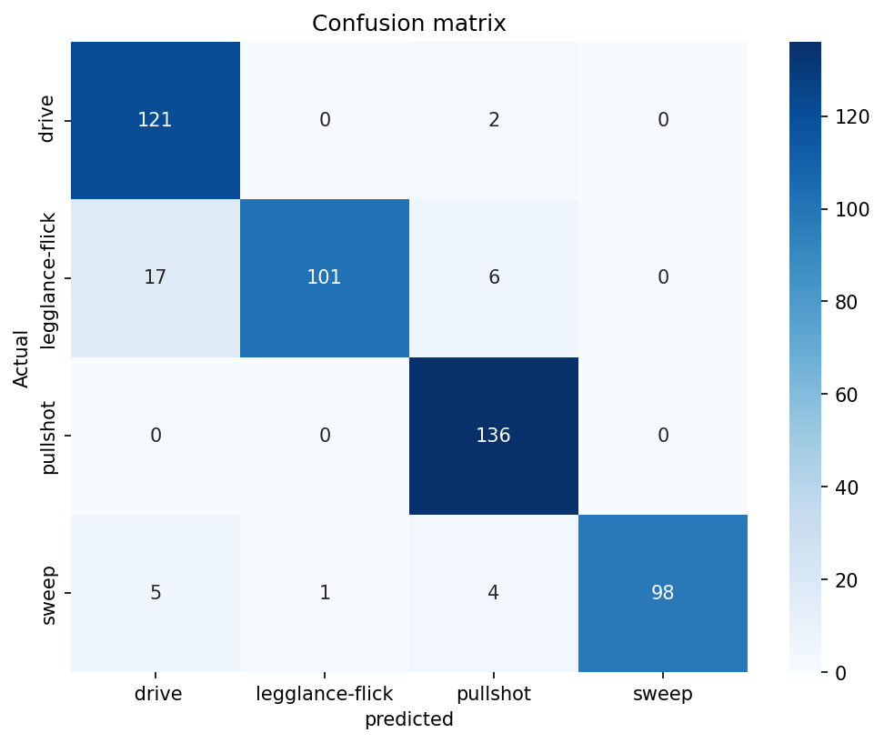

# 🏏 AI Cricket Shot Detector

A deep learning computer vision web application designed to instantly classify classic cricket shots from raw images. Built using **TensorFlow/Keras** and served via a lightning-fast **FastAPI** backend, this model was trained on thousands of action shots to distinguish between the subtle biomechanics of a cricket swing.

### 🌐 Live Demo
👉 **[Click Here to view the Live Web App](#insert_link_here)** *(Replace with your deployment link, e.g., Render/Vercel/AWS)*

### 📸 Interface Preview


---

## ✨ Features
* **Real-time Inference:** Upload an action shot and get predictions in milliseconds.
* **Granular Confidence Mapping:** Outputs exact probability percentages across all four classes.
* **ESPN Cricinfo Inspired UI:** A sleek, fully responsive Glassmorphism design featuring a dark/light mode toggle.
* **High-Accuracy Vision Engine:** Fine-tuned MobileNetV2 architecture achieving **~95.5% test accuracy**.

---

## ⚙️ How It Works
The application leverages **Transfer Learning**. Instead of training a CNN from absolute scratch, it uses **MobileNetV2** (pre-trained on the massive ImageNet dataset) as a highly optimized feature extractor. 

When a user uploads an image via the web interface:
1. The backend (`app.py`) reads the byte array in memory and uses `PIL` to convert it to an RGB format.
2. The image is resized to `(224, 224)` and expanded into a tensor batch.
3. The frozen `.keras` model processes the tensor, applying the learned weights to detect specific edges, bat angles, and body postures.
4. A Softmax dense layer outputs the final classification probabilities, which are passed back to the frontend to animate the CSS progress bars.

---

## 📊 Results & Model Evaluation
The model was evaluated against an isolated test set of unseen data. It excels exceptionally well at identifying pull shots and sweeps, with minor, expected cross-confusion between straight drives and front-foot leg-glances due to the nearly identical initial footwork.



* **Overall Test Accuracy:** 95.52%
* **Precision / Recall:** High stability across all classes, mapping explicitly to `['drive', 'legglance-flick', 'pullshot', 'sweep']`.

---

## 🛠️ Tech Stack
* **Deep Learning:** TensorFlow, Keras, MobileNetV2
* **Backend:** Python, FastAPI, Uvicorn
* **Data Processing:** NumPy, Pandas, Scikit-Learn, PIL
* **Visualization:** Matplotlib, Seaborn
* **Frontend:** HTML5, CSS3 (CSS Variables, Glassmorphism), Vanilla JavaScript

---

## 📂 Project Structure
```text
cricketShot_detector/
│
├── data/                               # Raw image dataset (4 classes)
├── assets/                             # README assets (matrices, demo screenshots)
│   ├── demo.png
│   └── confusion_matrix.png
│
├── static/                             # Frontend SPA
│   └── index.html                      
│
├── app.py                              # FastAPI server and inference logic
├── EDA.py                              # Exploratory Data Analysis & visual sanity checks
├── evaluate.py                         # Generates confusion matrix and classification reports
├── main.py                             # Local terminal testing script
├── model.py                            # Model architecture and 2-Phase training pipeline
├── preprocess.py                       # TensorFlow Dataset batching and splitting
│
└── Cricket_Shot_Detection_model.keras  # The finalized model weights (Ignored in Git)
```
---

## 🐛 Challenges Faced & Engineering Fixes

Building this wasn't without its massive roadblocks. Here are the major architectural bugs that had to be squashed:

### 1. The "100% Sweep" Data Leak Trap
* **Issue:** When carving out the Validation/Test sets, `validation_split=0.2` paired with `shuffle=False` caused the pipeline to slice off the alphabetical tail-end of the directory. The result? A test set consisting *entirely* of sweep shots.
* **Fix:** Enforced `shuffle=True` with a strict `seed=42` across *both* the training and evaluation pool initialization calls, guaranteeing a perfectly blended but isolated split.

### 2. Keras Computation Graph Desync
* **Issue:** Modifying the `base_model` global variable out in the open script to unfreeze layers for Phase 2 fine-tuning caused the inner wrapper `model` to lose track of its structural blueprint, resulting in silent crashes during `model.fit()`.
* **Fix:** Securely encapsulated the `MobileNetV2` base completely inside the `build_model()` functional scope and explicitly returned both the main wrapper and the tracking pointer. 

### 3. Ghost Repository Bloat
* **Issue:** Accidentally running `git add .` before writing a `.gitignore` locked 4,699 raw high-res images directly into Git's permanent tracking timeline, causing `git gc` and Windows OneDrive to crash simultaneously. 
* **Fix:** Completely nuked the corrupted `.git` folder, re-initialized the repository with the `.gitignore` in place, and force-pushed a clean, lightweight commit history.

---

## 🔄 Project Workflow

1. **Data Prep:** Images ingested via `tf.keras.utils.image_dataset_from_directory`.
2. **Augmentation:** Random flips, rotations, and contrast shifts applied strictly during training.
3. **Phase 1 Training:** Top layers trained for 10 epochs while the MobileNetV2 base remained completely frozen.
4. **Phase 2 Fine-Tuning:** Unfroze the top 30% of the base model, lowered the learning rate to `1e-5`, and trained for an additional 30 epochs to dial in cricket-specific features.
5. **Deployment:** Mounted the `.keras` mathematical asset into a FastAPI routing shell.

---

## ✍️ Final Note

Developed with a healthy mix of caffeine, grid-search patience, and late-night debugging by **Soumik Das** — Computer Science & Engineering, VNIT Nagpur. 

If you find this project helpful or have ideas to improve the dataset, feel free to fork it, submit a pull request, or drop a star! ⭐